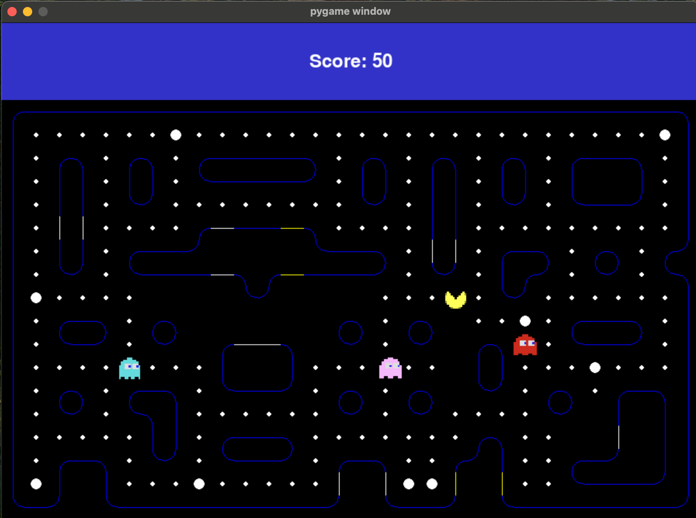
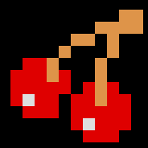
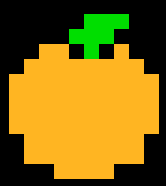
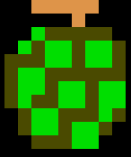
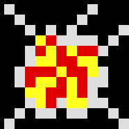
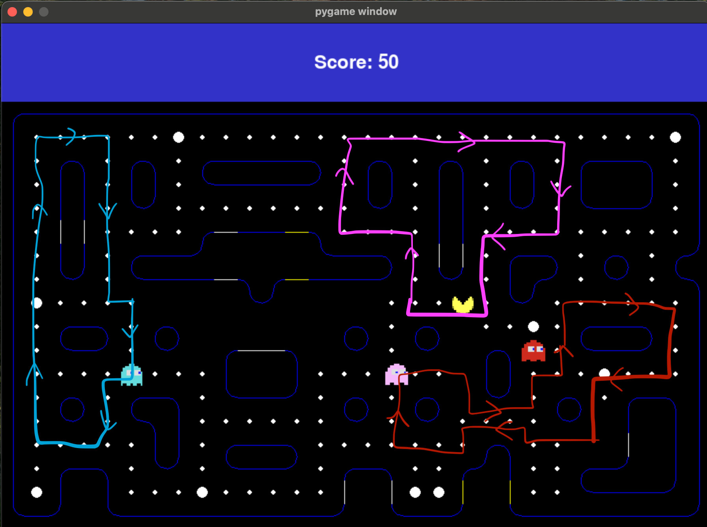
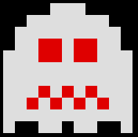
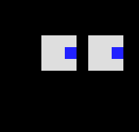

# Python_course

Zestawy zadań - Adam Nowak 

### Packman - FINAL PROJECT: 
Modified Pacman game in PyGame. Basic information here move specific in the code comments. 
I added few twists in the original Pacman. 
First of all custom map, various fruits and ghost movement.

### Basic starting view: 

##### Pacman Movement:
Pacman navigates through the map, his mouth opening and closing in an animated motion. He can pass through yellow walls but is restricted from crossing white walls.
When game starts pacman spawns on random cell with white dot on it!

##### Ghosts' Behavior:
When game starts ghosts spawn in particular places specified in the creation process.
There are three ghosts, each following a unique predefined route as their basic behavior.
If Pacman comes too close and the ghosts are not on a chase cooldown, they can switch to chase mode. In this mode, they calculate the shortest path to Pacman using the Breadth-First Search (BFS) algorithm.
Ghosts enter a "scared mode" for 5 seconds at different times, depending on the ghost's properties. During this time, Pacman can "kill" them by colliding with them. This result in 2000 score points!

##### Ghost Respawn:
If a ghost is killed while in scared mode, it returns to its starting point before resuming its personal route. Once back on its route, it can begin chasing Pacman again if he comes too close and the ghost’s cooldown has reset.
##### Randomized Properties:
Many of the ghosts' attributes, such as speed, chase duration, and scared mode cooldowns, are randomized within a predefined range at the start of each game.
##### Wall Interactions:
Ghosts have the ability to walk through white walls, unlike Pacman, who is restricted by them.

### Basic score and fruits: 
1. White dots are equal to 10 score points.
2. Bolded white dots equals 50 score points. 
3. Basic fruit = 1000 points!

4. Best fruit = 5000 points!

5. Speed fruit = pacman speed up to 0.35, normally 0.25!

6. Slow fruit = pacman speed down to 0.15, normally 0.25!

### Files Descriptions
##### Cell.py: 
Manages the map's grid system and serves as the backbone for map creation. This class handles operations such as spawning fruits and basic dots. It is also responsible for initially placing Pacman and ghosts on the map.
##### Ghosts.py: 
Manages ghost behavior, including their movement along predefined routes and dynamic Pacman-chasing. Handles mode transitions between normal, scared, and waiting (after being killed in scared mode). Implements collision detection with Pacman and calculates the shortest paths to him using the BFS algorithm.
##### Packman.py: 
Responsible for Pacman's movement and score tracking. Manages interactions with the map elements, such as collecting points and fruits, and updates the player's position and animations.
##### Menu.py: 
Creates a basic menu interface, allowing the player to start the game and view the highest and most recent scores.
##### Main.py: 
Handles the overall game initialization, including setting up the menu, drawing the game, and processing user input via the keyboard. Initializes core classes such as Pacman, Ghosts, Cell, and Menu, and coordinates their interactions.
##### map_data.py: 
Contains the map structure, represented as a matrix where each value corresponds to a specific element of the game. 

For example:
1: Vertical wall
7: Basic white dot (collectible)
10: Ghost spawn point
Defines the layout and positioning of walls, collectibles, and character spawn points.

#### Ghosts routes: 

#### Ghosts modes: 
##### Normal: can be seen above on the map!
##### Scared: 
 
##### Waiting: 

